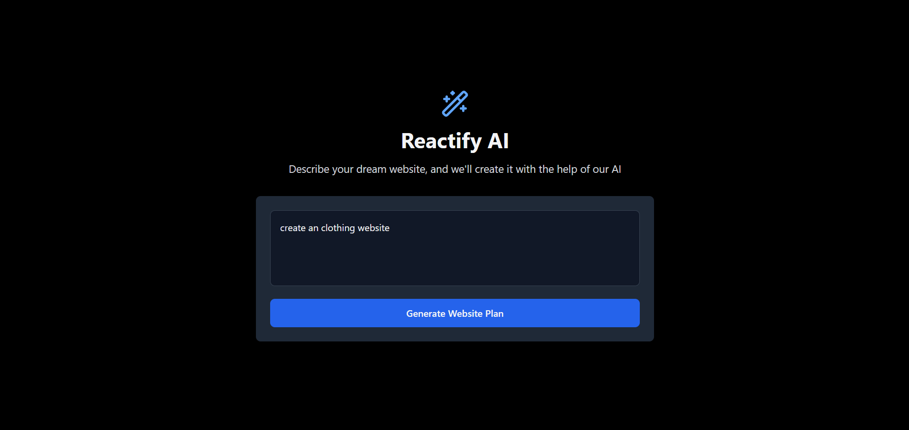
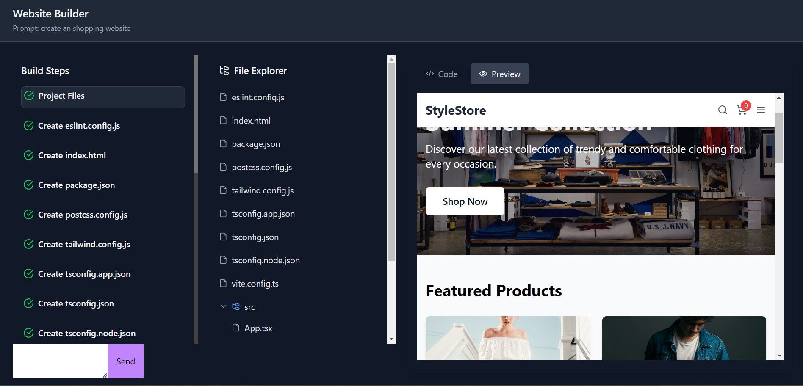

## 🤖 Reactify

**Reactify** is an innovative AI-powered code generator designed to streamline the development of full-stack and React applications. With its ability to deliver live previews using **WebContainer** and generate efficient, scalable code via an **LLM wrapper class**, Reactify makes development faster and more accessible. Built entirely with **TypeScript**, it ensures type safety, maintainability, and a robust development experience.

## 🚀 Features

- **AI Code Generation**: Automatically generate production-ready React and full-stack applications.
- **Live Preview**: Instantly preview your application in a live environment using WebContainer.
- **Customizable Templates**: Modify the generated code to suit your specific requirements.
- **Full-Stack Integration**: Support for backend frameworks and database integration.
- **Modern Tech Stack**: Built with the latest tools and technologies for optimal performance.
- **User-Friendly Interface**: A clean, intuitive UI for developers of all levels.

## 🛠️ Tech Stack

- **Frontend**: React, CSS, TypeScript
- **Backend**: Node.js, Express, TypeScript
- **Code Execution**: WebContainer for live environment simulation
- **AI Engine**: LLM Wrapper Class 

## 📷 Screenshots

### Main Interface (Landing Page)
 

### Live Preview (Code Generation Page)
 


## 📦 Installation

### Prerequisites
- Node.js (v16 or higher)
- npm or yarn

### Steps
1. Clone the repository:
   ```bash
   git clone https://github.com/sairam5686/React-AI-Reactify.git
   cd reactify
   ```

2. Install dependencies:
   ```bash
   npm install
   # or
   yarn install
   ```

3. Start the application:
   ```bash
   npm start
   # or
   yarn start
   ```

4. Open your browser and navigate to:
   ```
   http://localhost:4000
   ```

## 💻 Usage

1. Launch Reactify.
2. Enter a project description or requirements in the AI code generator.
3. Choose between **React** or **Full-Stack** application generation.
4. Preview the live application in real-time.
5. Export or customize the generated code as needed.


